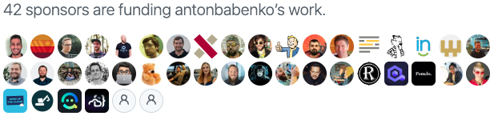

# Various links to most of my Terraform, AWS, and DevOps projects

## Social links

1. [Primary blog - antonbabenko.com](https://www.antonbabenko.com) - not very active
1. [Blog - medium.com](https://medium.com/@anton.babenko) - not very active
1. [Company - betajob.com](https://www.betajob.com)
1. [AWS Community Hero profile](https://aws.amazon.com/developer/community/heroes/anton-babenko/)
1. [Github](https://github.com/antonbabenko)
1. [Linkedin](https://www.linkedin.com/in/antonbabenko/)
1. Twitter: [@antonbabenko](https://twitter.com/antonbabenko), [@weeklytf](https://twitter.com/weeklytf), [@modulestf](https://twitter.com/modulestf)
1. [Slideshare](http://www.slideshare.net/AntonBabenko) - many slide decks of my talks

## Like what I do? There are several ways to support me!

1. [GitHub Sponsors](https://github.com/sponsors/antonbabenko) - recommended way
1. [Open Collective](https://opencollective.com/modulestf)
1. [Buy me a coffee](https://www.buymeacoffee.com/antonbabenko)
1. [Paypal](https://www.paypal.me/antonbabenko)
1. [Patreon](https://patreon.com/antonbabenko)

Contact me, if you want to sponsor the development of the open-source projects or any media projects listed below.

## Media projects

### [Your Weekly Dose of Terraform](http://bit.ly/terraform-youtube)

Weekly live streams on YouTube with reviews, interviews, Q&A, live coding, and some hacking with Terraform.
Stats (June 2024): 9.1K+ subscribers.

Playlists:
1. [Terraform tools reviews](https://www.youtube.com/playlist?list=PLvz1V_9d3uivwNgADT_eB-wKEWOzOOQXy)
1. [Terraform live coding](https://www.youtube.com/playlist?list=PLvz1V_9d3uis9mxZ8eATA6l9Sr1XLeY4Y)

### [weekly.tf - Terraform Weekly newsletter](https://weekly.tf)

Weekly newsletter with updates from the Terraform world - blog posts, open-source projects, announcements, discussions. Stats (June 2024): 7K+ subscribers, 176 newsletters.

[Use Google](https://www.google.com/search?q=site%3Aweekly.tf) to search in the previous newsletters.

## Utilities

1. [pre-commit-terraform](https://github.com/antonbabenko/pre-commit-terraform) - keep Terraform and Terragrunt code in a good shape (validate, format, document, security checks, cost estimation, and more).
1. [terraform-cost-estimation](https://github.com/antonbabenko/terraform-cost-estimation) - anonymized, secure, and free Terraform cost estimation based on Terraform plan (0.12+) or Terraform state (any version). Also, available from the browser - [terraform-cost-estimation.com](https://terraform-cost-estimation.com)
1. [awsp](https://github.com/antonbabenko/awsp) - AWS credential profile changer.

## Big projects

### [compliance.tf](https://compliance.tf) - Making your Terraform modules compliance-ready

Fix audit gaps in advance using SOC2, PCI DSS, HIPAA, and CIS compliance-ready Terraform configurations.

### [serverless.tf](https://serverless.tf) - Doing serverless with Terraform

serverless.tf framework aims to provide information, solutions, and tools for building, deploying, and managing serverless applications and infrastructure using Terraform. Read more about "What? Why? How?" at [antonbabenko/serverless.tf](https://github.com/antonbabenko/serverless.tf).

### [modules.tf](https://modules.tf) - Visual Studio Code extension for Terraform

Boost developer productivity when working with Terraform — semantic highlighting, autocomplete, and diagnostics should be just a beginning.

### [terraform-aws-modules](https://github.com/terraform-aws-modules)

Open-source collection of more than 60 Terraform AWS modules managed by the community for most popular AWS services with examples and documentation. These modules were downloaded more than 1 billion times from [Terraform Registry](https://registry.terraform.io/namespaces/terraform-aws-modules).

### [terraform-best-practices.com](https://www.terraform-best-practices.com/) - Terraform Best Practices (free ebook).

Available translations:
* [English](https://www.terraform-best-practices.com/)
* [العربية (Arabic)](https://www.terraform-best-practices.com/v/ar/) by [Nidal Shater](https://www.linkedin.com/in/nidal-shater/)
* [Bosanski (Bosnian)](https://www.terraform-best-practices.com/v/ba/) by [Dzenan Dzevlan](https://www.linkedin.com/in/sqlheisenberg/)
* [Português (Brazilian Portuguese)](https://www.terraform-best-practices.com/v/ptbr/) by [Lucas Possamai](https://www.linkedin.com/in/lucaspossamai)
* [Français (French)](https://www.terraform-best-practices.com/v/fr/) by [Nicanor Foping](https://www.linkedin.com/in/nicanor-foping)
* [ქართული (Georgian)](https://www.terraform-best-practices.com/v/ka/) by [Jaba Macharashvili](https://www.linkedin.com/in/jaba0x/)
* [Deutsch (German)](https://www.terraform-best-practices.com/v/de/) by [Johannes Grumböck](https://www.linkedin.com/in/jgrumboe)
* [ελληνικά (Greek)](https://www.terraform-best-practices.com/v/el/) by [Pavlos Kaimakis](https://www.linkedin.com/in/pavlos-kaimakis/) and [Konstantinos Kourmousis](https://www.linkedin.com/in/kkourmousis/)
* [עברית (Hebrew)](https://www.terraform-best-practices.com/v/he/) by [Zvi Blitsman](https://www.linkedin.com/in/zvi-b-4b20bb143/)
* [िंदी (Hindi)](https://www.terraform-best-practices.com/v/hi/) by [Dipali Kulshrestha](https://www.linkedin.com/in/dipalik/)
* [Bahasa Indonesia (Indonesian)](https://www.terraform-best-practices.com/v/id/) by [Roy Inganta Ginting](https://www.linkedin.com/in/royinganta)
* [Italiano (Italian)](https://www.terraform-best-practices.com/v/it/) by [Giuseppe Borgese](https://www.linkedin.com/in/giuseppe-borgese-64181a7/)
* [ಕನ್ನಡ (Kannada)](https://www.terraform-best-practices.com/v/kn/) by [Trivikrama Harikrishnan](https://www.linkedin.com/in/trivih/)
* [한국어 (Korean)](https://www.terraform-best-practices.com/v/ko/) by [Gwen Leigh](https://www.linkedin.com/in/gwen-leigh/)
* [Polski (Polish)](https://www.terraform-best-practices.com/v/pl/) by [Jakub Piotr Hamerliński](https://www.linkedin.com/in/hamerlinski)
* [Română (Romanian)](https://www.terraform-best-practices.com/v/ro/) by [Andra Glavan](https://www.linkedin.com/in/andra-glavan-0003ab69/)
* [简体中文 (Simplified Chinese)](https://www.terraform-best-practices.com/v/zh/) by [Yao Cheng](https://www.linkedin.com/in/yaocheng0517/)
* [Español (Spanish)](https://www.terraform-best-practices.com/v/es/) by [Abel López](https://www.linkedin.com/in/abelopz)
* [Türkçe (Turkish)](https://www.terraform-best-practices.com/v/tr/) by [Bilgehan Nal](https://www.linkedin.com/in/bilgehan-nal/)
* [Українська (Ukrainian)](https://www.terraform-best-practices.com/v/uk/) by [Oksana Lyhuta](https://www.linkedin.com/in/oksanalyguta)
* [اردو (Urdu)](https://www.terraform-best-practices.com/v/ur/) by [Abaid Gulshan](https://www.linkedin.com/in/abaidgulshan/)

See also [terraform-best-practices-workshop repository](https://github.com/antonbabenko/terraform-best-practices-workshop) for hands-on materials.

## Small projects, code from my talks

1. May 2020 - [Terragrunt Reference Architecture](https://github.com/antonbabenko/terragrunt-reference-architecture).
1. February 2020 - [Code for the talk "Manage any AWS resource with Terraform"](https://github.com/antonbabenko/terraform-aws-anything).
1. [Make your terragrunt output useful](https://gist.github.com/antonbabenko/675049186e54b770b4789886d2056639) - shell alias which cut useless parts of Terragrunt output.

## Abandoned and incomplete projects

1. [Diagrams to code (d2c) - Infrastructure as code generator - from visual diagrams created with Cloudcraft.co to Terraform](https://github.com/antonbabenko/modules.tf-lambda) - [Source and Terraform infrastructure configurations](https://github.com/antonbabenko/modules.tf-lambda) built using [serverless.tf framework](https://serverless.tf). [Sample code produced by D2C tool](https://github.com/antonbabenko/modules.tf-demo). Not available via **cloudcraft.co** for new accounts since June 2022.
1. [tfvars-annotations](https://github.com/antonbabenko/tfvars-annotations) - Update values in terraform.tfvars using annotations
1. [terrapin](https://github.com/antonbabenko/terrapin) - Terraform module generator
1. [terrible](https://github.com/antonbabenko/terrible) - Let's orchestrate Terraform configuration files with Ansible! Terrible idea! :)
1. [terraform-docs-as-pdf](https://github.com/antonbabenko/terraform-docs-as-pdf) - for people who like PDFs or work offline.

Remember to watch, star and share this repository with your network!
